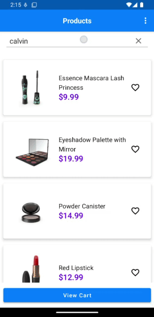

# Simplified Kiosk App

## Project structure

The main `app` directory is the root of the Android app. It contains all the components that make up the app. 
The subdirectories of `app` are:

- `dao`: contains the DAO interfaces and their implementations
- `database`: contains the Room database
- `di`: contains the dependency injection modules
- `model`: contains the data models used in the app
- `network`: contains the Retrofit network setup
- `repository`: contains the repository interfaces and their implementations
- `ui`: contains the UI components. The subdirectories of `ui` are:
  - `itemlist`: contains the components for the item list screen
  - `itemdetails`: contains the components for the item details screen
  - `cart`: contains the components for the cart screen
  - `checkout`: contains the components for the checkout screen

The app uses the MVVM architecture pattern for separation of concerns between the UI and business logic. 
- The ViewModels in the `viewmodel` package encapsulate the business logic of the app and hold the state of the UI.
- The Fragments in the `ui` package act as the View and observe the state in the ViewModel to update the UI. 

The ViewModels use Flow to notify the UI of any changes to the state. For example, the `ItemDetailsViewModel` uses Flow 
to notify the `ItemDetailsFragment` of the details of the item to be displayed. 
The `ItemDetailsFragment` observes this Flow and updates the UI accordingly. This allows the app to be more modular and easier to test.

The app also uses the following dependencies:
- Room persistence library for caching data locally.
- Retrofit to make network requests.
- Kotlin Flow and Coroutines for asynchronous operations.
- Jetpack's Navigation component to navigate between fragments.
- The UI is built using a mixed of Jetpack Compose and XML views.

## How to run this project in Android Studio

1. Clone this repository
2. Open this project in Android Studio
3. Use the Import option to open the project
4. Run the app on an emulator or a physical device